 # VirtualTaiko

  ---

  작성자 : 오도경

  궁금한 점 있을 시 Issue 남겨주시면 답변드립니다!

  # 목차

  - [개요](#개요)
    * [작성 의의](#작성-의의)
    * [소개](#소개)
      + [함께 사용된 라이브러리](#함께-사용된-라이브러리)
      + [문서 내용](#문서-내용)
  - [Part 1. 구현 기능 ](#part-1-구현-기능)
    * [구현된 기능 리스트](#구현된-기능-리스트)
      + [게임플로우](#게임플로우)
      + [리듬 판정/스코어](#리듬-판정스코어)
      + [UI 연출](#ui-연출)
    - [Part 2. 디자인 패턴 소개](#part-2-디자인-패턴-소개)
        * [State 패턴](#state-패턴)
        * [MVP 패턴](#mvp-패턴)
        * [Strategy 패턴](#strategy-패턴)
        * [Observer 패턴](#observer-패턴)
        * [Object Pool 패턴](#object-pool-패턴)
    - [Part 3. 프로젝트에 적용된 디자인 패턴의 의도와 효과](#part-3-프로젝트에-적용된-디자인-패턴의-의도와-효과)
        * [State 패턴](#1-state-패턴)
        * [MVP 패턴](#2-mvp-패턴)
        * [Strategy 패턴](#3-strategy-패턴)
        * [Observer 패턴](#4-observer-패턴)
        * [Object Pool 패턴](#5-object-pool-패턴)
    - [더 나아가서 고민해볼 것](#더-나아가서-고민해볼-것)

  ---

  # 개요

  ## 작성 의의

Virtual Taiko 개발 과정에서 **왜 특정 디자인 패턴을 선택했는지, 어떤 문제를 해결하려 했는지**를 정리한다.
단순한 구현 기록을 넘어, 설계 관점의 판단 근거를 남기는 것이 목적이다.

  ## 소개

  ### 함께 사용된 라이브러리

  1. XR Interaction Toolkit
  2. DOTween

  ### 문서 내용

  Part 1에서는 프로젝트의 주요 기능을 정리한다.
  Part 2에서는 실제 코드에서 확인되는 디자인 패턴을 중심으로 설명한다.
  Part 3에서는 핵심 시스템의 구조를 설명한다.
  Part 4에서는 노트 생성부터 판정 및 결과 처리까지의 흐름을 정리한다.

  ---

  # Part 1. 구현 기능
[VirtualTaiko_Meta 시연 영상](https://www.youtube.com/watch?v=1iih5HtXFA8&t=1s)

본 프로젝트는 VR 일본 축제 테마의 가상 공간에서 북을 직접 두드리며 리듬 게임 ‘태고의 달인’을 플레이할 수 있도록 구현한 작품입니다. 

VR 월드 안에 가상의 북 인터랙션을 구성하고, 그 공간에서 동작하는 2D 태고의 달인 게임 화면/판정 시스템을 함께 구현했습니다.
  ## 구현된 기능 리스트

  ### 게임플로우
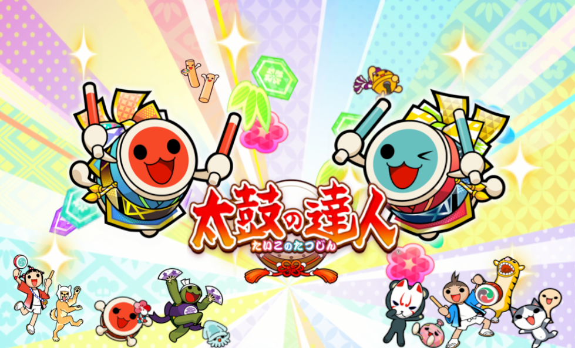
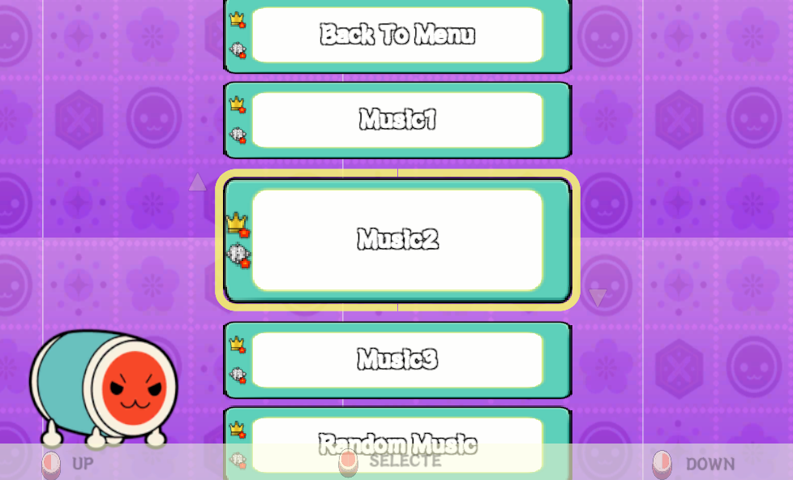
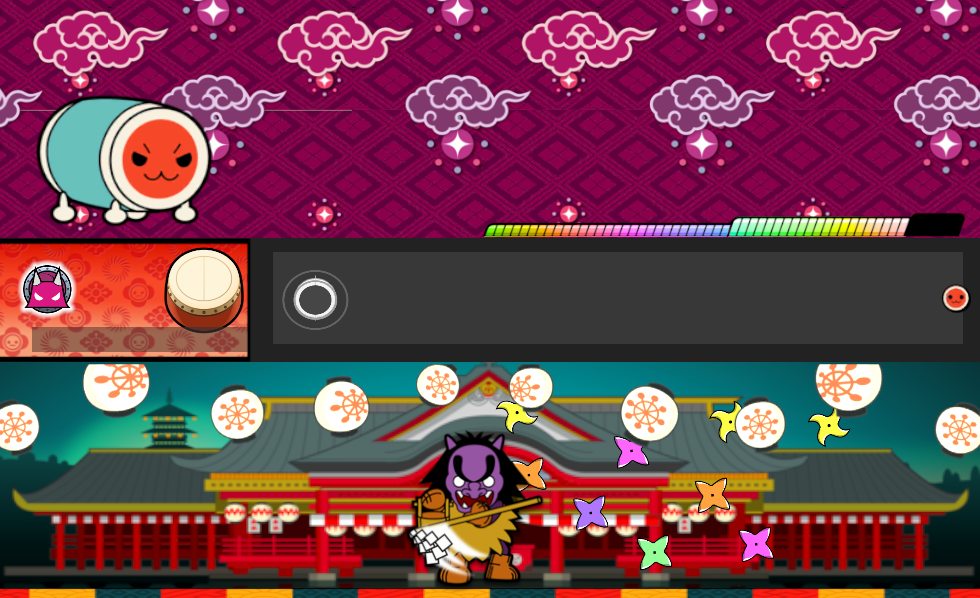
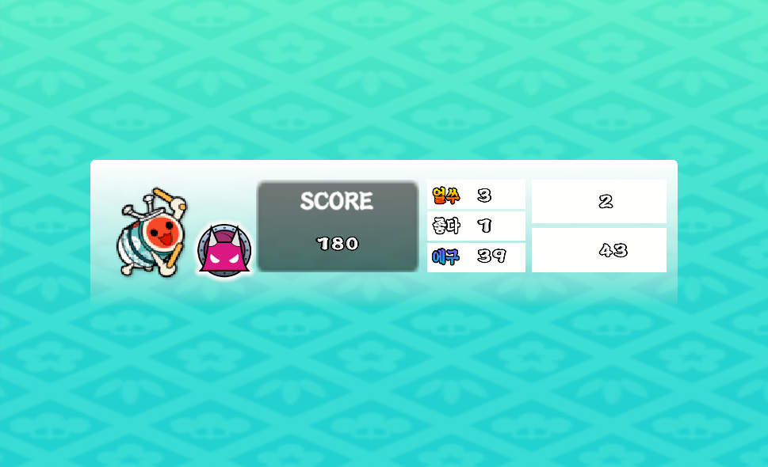
  - Start → MusicChoice → Play → Result의 상태 전환 구조
  - `GameStateMachine`과 `IGameState`로 상태 관리
  - `SceneManager`를 통해 씬 오브젝트 전환 + 페이드 연출

  ### 리듬 판정/스코어
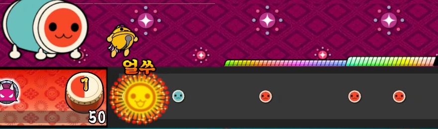
  - `TimingManager`가 가장 가까운 노트를 찾아 판정
  - `ScoreData`에서 콤보/스코어/데드게이지 계산

  ### UI 연출
  - 음악 선택 UI: `ChoiceView` + `ChoicePresenter` + `ChoiceModel`
  - DOTween 기반 애니메이션 연출
  - `NumberImagePool`로 숫자 UI 풀링 처리

  ---

# Part 2. 디자인 패턴 소개
본 문서의 목표는 프로젝트에 적용된 디자인 패턴을 쉽게 파악하는 것이다.

고로 본 내용에 들어가기 전, 이 프로젝트에 사용된 디자인 패턴들을 먼저 정리하고 넘어가고자 한다.
## State 패턴
### State 패턴이란? 
State 패턴은 "상태에 따라 행동이 바뀌는 로직을 분리" 하는 패턴이다.

게임 개발에서 특히 흔한 상황이 있다.
- 캐릭터가 대기/이동/공격/피격/기절 상태일 때 행동이 달라짐
- UI가 열림/닫힘/로딩 중 상태일 때 입력 처리 방식이 달라짐
- 몬스터 AI가 순찰/추적/공격/도주 상태로 계속 전환됨

이런 경우를 잘 다루기 위해 나온 것이 State 패턴이다.

상태에 따라 행동이 달라지는 객체의 로직을 **if/else 덩어리로 처리하지 않고**, **"상태 객체(State)"** 로 분리해서 관리하는 패턴이
State 패턴의 목적이라고 생각한다.

여기서 드는 근본적인 질문은, 왜 상태 로직을 분리하는가이다.

객체 지향 설계의 핵심은
* 중복을 줄이고
* 자주 변하는 것과 자주 변하지 않는 것을 분리하는 것이다.

상태 기반 로직을 한 클래스에 몰아넣으면 보통 이런 형태가 된다.
* Update에서 계속 if (state==...)
* 상태마다 입력 처리, 애니메이션, 이동, 공격 판정 등이 얽힘
* 상태가 늘어날수록 조건문이 폭발하고, 수정할수록 버그가 늘어남

즉, 상태가 늘어날수록 변경 비용이 급격히 커지는 구조가 된다.

또한 상태 로직은 대표적으로 "자주 변하는 요소"다.
* 디자이너/기획 요구로 상태 전환 조건이 바뀜.
* 특정 상태에 연출이 추가됨 (이펙트/사운드/카메라)
* 특정 상태가 새로 추가됨(예: 회피, 차지, 패링)

자주 변하는 상태 로직과, 자주 변하지 않는 핵심 시스템(공통 데이터/공통 인터페이스)을 같이 두면 작은 변경이 큰 수정으로 번지고, 유지보수가 어려워진다.

그래서 State 패턴은 상태별  로직을 분리해 개발자가 "각 상태의 규칙"에만 집중할 수 있게 만든다.

### State 패턴 방식
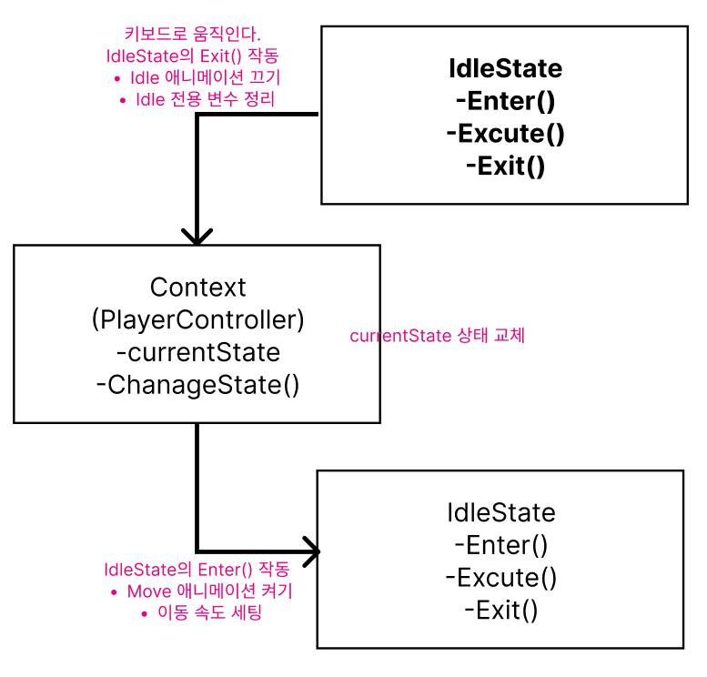
* 공통 인터페이스(예: Enter/Execute/Exit)를 가진 상태 클래스를 만든다.
* Context는 “현재 상태”를 들고 있고, 로직은 상태 객체에 위임한다.
* 상태가 바뀔 때는 다음 순서로 교체한다:
1. 현재 상태 Exit()
2. 상태 교체
3. 새 상태 Enter()

그리고 매 프레임은 현재 상태의 Execute()를 호출한다.
## MVP 패턴
### MVP 패턴이란?
MVP 패턴은 Data와 Input/Output을 비즈니스 로직으로부터 분리하고자 하는 것을 목표로 한다.

여기서 드는 근본적인 질문은, 왜 Data와 Input/Output을 비즈니스 로직과 분리하는가이다.

객체 지향 설계의 핵심은 클래스 간에 중복 사항은 하나로 합치고 자주 변하는 것과 자주 변하지 않는 것을 분리하는 것이다.

일반적으로 Data는 특정 클래스에 종속되지 않고 다양한 클래스에서 공용으로 사용되는 경우가 많다.

즉, Data를 각 비즈니스 로직 클래스에서 관리하다보면 중복이 생기기 쉽다. 그래서 분리한다.

Input/Output의 경우 대표적으로 자주 변하는 요소에 속한다.

늘 연출은 클라이언트의 요청에 따라 이리저리 바뀌기 마련이다.

자주 변하는 것과 자주 변하지 않는 것을 같이 두면 자주 변할 필요가 없는 부분도 잦은 수정이 이뤄지기 때문에 분리한다.

결과적으로 개발자는 비즈니스 로직에만 집중할 수가 있게 된다.


### MVP 패턴 방식
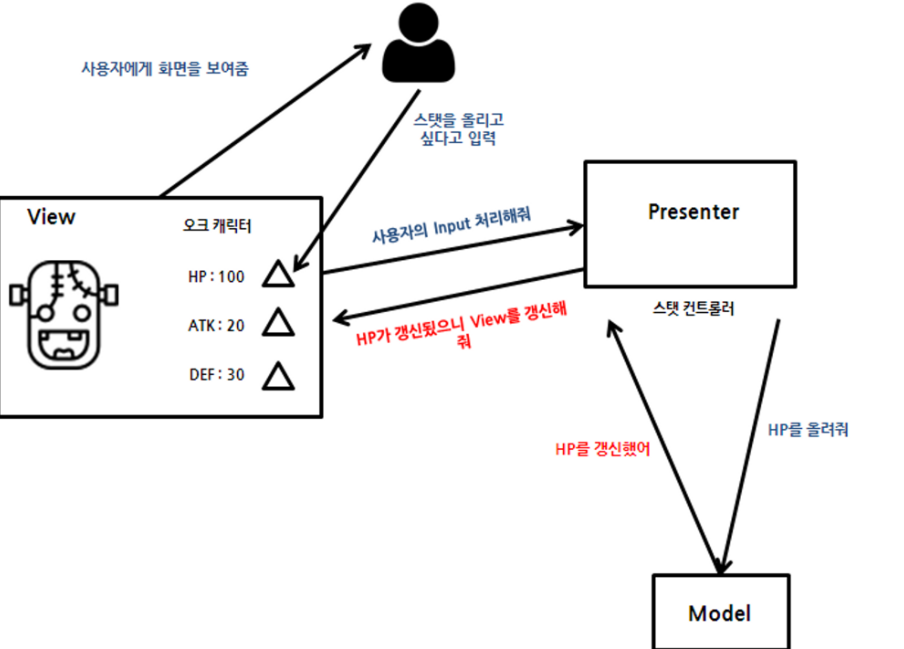
View와 Model 사이의 모든 상호작용을 Presenter가 담당하는 구조이다.

UI가 직접 로직을 처리하지 않고, Presenter가 "입력 처리 + 데이터 갱신 + 화면 갱신"을 모두 중재하는 패턴이다.
* View: 화면 표시 + 사용자 입력 전달만 담당
* Model: 데이터/상태/도메인 규칙
* Presenter: 로직 처리 + Model 업데이트 + View 업데이트 
## Strategy 패턴
### Strategy 패턴이란?
Strategy 패턴은 “행동(알고리즘/규칙)”을 여러 개 준비해두고,
상황에 따라 그중 하나를 선택해서 갈아끼우는 패턴이다.

방법이 여러 개인 로직을 한 클래스에서 if/else로 처리하면
* 입력 방식이 키보드/패드/터치로 나뉨
* 적 AI 공격 방식이 여러 종류 
* 데미지 계산(치명타/방어/속성) 방식이 여러 종류

결과:
* 코드가 길고 복잡해짐 
* 새 방식 추가할 때 기존 코드를 계속 수정해야 함(버그 위험 증가)

그래서 Strategy는 변하기 쉬운 “방법”을 분리해서 기존 코드를 거의 건드리지 않고 새로운 방법을 추가/교체할 수 있게 만든다.

### Strategy 패턴 방식
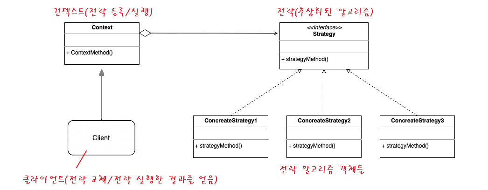
출처: [전략(Strategy) 패턴 - 완벽 마스터하기](https://inpa.tistory.com/entry/GOF-%F0%9F%92%A0-%EC%A0%84%EB%9E%B5Strategy-%ED%8C%A8%ED%84%B4-%EC%A0%9C%EB%8C%80%EB%A1%9C-%EB%B0%B0%EC%9B%8C%EB%B3%B4%EC%9E%90)

Strategy (전략 인터페이스)
* “이 기능을 수행하는 공통 방식”의 형태를 정의
* 예: CalculateDamage(), Move(), GetInput()

Concrete Strategy (구현 전략들)

* 실제로 동작하는 여러 방법들 
* 예: KeyboardInputStrategy, TouchInputStrategy 
* 예: MeleeAttackStrategy, RangedAttackStrategy

Context (전략 사용자)
* 전략을 들고 있는 객체
* 전략을 직접 구현하지 않고 “위임”한다.
* 필요하면 런타임에 전략을 교체한다.

방식(흐름)

1. Context가 Strategy를 하나 가진다. 
2. Context는 작업이 필요할 때 Strategy의 메서드를 호출한다. (위임)
3. 상황이 바뀌면 Strategy를 교체한다. (갈아끼우기)
4. 같은 Context라도 전략이 바뀌면 결과 동작이 달라진다.
## Observer 패턴
### Observer 패턴이란?
Observer 패턴은 "어떤 값/상태가 바뀌면 그걸 구독하고 있던 애들에게 자동으로 알려주는" 패턴이다.
게임/앱에서 UI 갱신, 이벤트 알림, 상태 동기화 같은 곳에 엄청 자주 쓰인다.

한 객체(Subject/Publisher)의 상태가 바뀌면, 이를 구독(Subscribe)하고 있는 여러 객체(Observer/Subscriber)에게 자동으로 알림(Notify)을 보내서 반응하도록 만드는 패턴
* Subject(발행자): "나 바뀜!"을 알리는 쪽
* Observer(구독자): 알림을 받고 행동하는 쪽

여기서 드는 근본적인 질문은, 왜 굳이 "알림 구조"로 분리하는가이다. 

서로의 정보를 주고 받는 객체들의 규모가 클수록 복잡성이 증가하게 된다. 예를 들어 마음에 드는 집 매물이 나왔는지 확인하고 싶다고 가정하자.

1. 옵저버 패턴을 사용하지 않는 경우 : 입주 희망자는 공인 중개사에 집 매물이 나올 때까지 계속 전화를 해봐야 할 것이다.
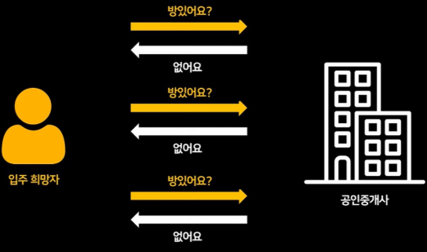

출처: https://www.youtube.com/watch?v=boXNtyeOzuc


2. 옵저버 패턴을 사용하는 경우 : 입주 희망자는 공인 중개사에 전화해서 방나오면 알려주세요라고 한 다음 굳이 또 연락을 할 필요가 없이 방에 나오게되면 공인중개사 쪽에서 연락을 할 것이다.
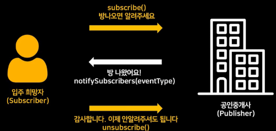

출처: https://www.youtube.com/watch?v=boXNtyeOzuc
### Observer 패턴 방식
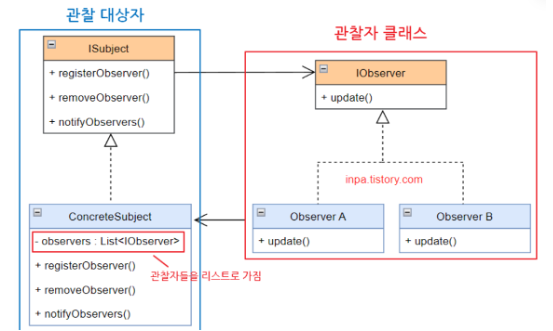

출처: [옵저버(Observer) 패턴 - 완벽 마스터하기](https://inpa.tistory.com/entry/GOF-%F0%9F%92%A0-%EC%98%B5%EC%A0%80%EB%B2%84Observer-%ED%8C%A8%ED%84%B4-%EC%A0%9C%EB%8C%80%EB%A1%9C-%EB%B0%B0%EC%9B%8C%EB%B3%B4%EC%9E%90)

Subject / Observable (발행자)
* 관찰 대상 
* 구독자 목록을 관리한다. 
* 상태가 바뀌면 구독자들에게 알린다.

기능:
* Subscribe(observer) : 구독 추가 
* Unsubscribe(observer) : 구독 해제 
* Notify() : 상태 변경 알림 

Observer (구독자)
* 발행자의 알림을 받는 대상 
* 알림을 받으면 자기 역할(화면 갱신 등)을 수행한다.

기능:
* OnNotify(...) 또는 Update(...) 같은 콜백 함수

## Object Pool 패턴
### Object Pool 패턴이란?
게임에서 총알, 이펙트, 히트 스파크, 데미지 텍스트처럼 짧게 생성됐다가 사라지는 오브젝트를 자주 만들면 성능 문제가 생기기 쉽다.
Object Pool은 이런 오브젝트들을 “미리 만들어 두고” 필요할 때 꺼내 쓰고 다시 반납하는 패턴이다.

Unity에서 Instantiate와 Destroy는 비용이 큰 편이고, 특히 많이 반복되면
* 프레임 드랍(끊김)
* GC(가비지 컬렉션)로 인한 순간 멈춤
* 모바일/VR에서 체감 성능 저하

가 쉽게 생긴다.

즉, “자주 변하는 것(짧게 생겼다 사라지는 오브젝트)”을
매번 새로 만들지 말고, 자주 안 변하는 것(오브젝트 자체) 을 재사용하자는 목적이다.

### Object Pool 패턴 방식
Pool(풀 관리자)

* 비활성 오브젝트들을 보관하는 창고

* 기능:

  * Get() : 꺼내오기(활성화)
  * Return() : 반납하기(비활성화 후 보관)
  * (선택) 미리 생성(Warm-up), 부족하면 추가 생성(Expand)

Pooled Object(풀에 들어가는 오브젝트)

* 풀에서 꺼내졌다가 다시 들어갈 대상 
* 보통 “스스로 수명 끝나면 Return 호출”하도록 만들기도 함 
  * 예: 파티클 끝나면 자동 반납 
  * 예: 데미지 텍스트 1초 후 반납
  
# Part 3. 프로젝트에 적용된 디자인 패턴의 의도와 효과
Part 3에서는 VirtualTaiko에 실제 적용된 패턴을 도입 이유 -> 코드 핵심 -> 설명 -> 이점 순서로 정리한다.

## 1) State 패턴
### 도입 이유
Start -> MusicChoice -> Play -> Result로 흐름이 고정되어 있어, 상태 전환과 상태별 로직을 명확히 분리할 필요가 있었다.
  ```csharp
  public void ChangeState(IGameState newState)
  {
      _currentState?.Exit();
      _currentState = newState;
      _currentState?.Enter();
  }

  설명: GameStateMachine이 상태 전환 규칙을 한 곳에서 통제한다.
  현재 상태 종료(Exit) → 상태 교체 → 새 상태 진입(Enter) 순서로 통일된다.

  public void Enter()
  {
      ChoicePresenter.OnMusicChosen += HandleMusicChosen;
      Single.System.SceneManager.LoadScene(SceneDataType.MusicChoice);
  }

  설명: 각 상태는 자기 역할만 담당한다.
  예: MusicChoiceState는 “씬 전환 + 선택 이벤트 구독”만 맡는다.
```
### 이점
- GameStateMachine이 Update에서 _currentState.Execute()만 호출해 게임 흐름이 단순화됨.
- StartState는 입력 대기, PlayState는 게임 진행, ResultState는 결과 입력만 담당해 역할이 분리됨.
- 씬 로딩이 상태에 묶여 있어 흐름이 읽기 쉬움.


## 2) MVP 패턴
### 도입 이유
MusicChoice UI는 입력, 스크롤 애니메이션, 데이터 갱신이 동시에 발생하므로
“UI 연출”과 “데이터 처리”를 분리하지 않으면 수정 비용이 커진다.

```csharp
_choiceView.OnScrollUpRequested += HandleScrollUpRequested;
_choiceModel.OnChoiceUpdated += HandleChoicesUpdated;

설명: Presenter가 View/Model 사이를 중재한다.

public void ScrollUp()
{
MusicData top = _musicChoices[0];
_musicChoices.Remove(top);
_musicChoices.Add(top);
OnChoiceUpdated?.Invoke(_musicChoices);
}

설명: Model은 데이터만 변경하고 View는 건드리지 않는다.
```
### 이점

- ChoiceView의 DOTween 연출을 바꿔도 ChoiceModel 로직은 영향 없음.
- 음악 목록 변경은 ChoiceModel에만 집중되므로 유지보수가 쉬움.
- Presenter에서 이벤트 흐름이 한눈에 보임.

## 3) Strategy 패턴

### 도입 이유
실제 플레이 에서는 VR 입력 방식을 사용하고 테스트할 때 Keyboard 입력을 사용하기 위해
게임플레이 코드는 동일한 입력 타입을 받아야 한다.

```csharp

if (isVREnabled)
_inputProvider = gameObject.AddComponent<VRInputProvider>();
else
_inputProvider = gameObject.AddComponent<KeyboardInputProvider>();

public DrumDataType GetInput()
{
return _inputProvider.GetDrumInput();
}

설명: 입력 제공자만 교체하고 외부 API는 고정한다.
```
### 이점

- StartView, ResultState 등은 입력 방식과 무관하게 InputManager.GetInput()만 호출하면 됨.
- VR 입력 구현이 변경돼도 UI/게임플레이 로직 수정이 최소화됨.

## 4) Observer 패턴

### 도입 이유
점수/콤보/게이지 변경을 UI와 이펙트가 동시에 반영해야 하므로
직접 참조 방식은 확장성이 떨어진다.

```csharp

  GameEvents.TriggerOnScoreUpdated(_scoreData.score);
  GameEvents.TriggerOnComboUpdated(_scoreData.combo);

  GameEvents.OnDeadGauge += HandleDeadGaugeUpdated;

  설명: PlayController는 이벤트만 발행하고, UI는 구독한다.
```
### 이점
- PlayController가 UI를 직접 참조하지 않아 결합도가 낮음.
- DeadGauge처럼 별도의 UI가 필요한 경우 이벤트만 구독하면 추가 가능

## 5) Object Pool 패턴

### 도입 이유
숫자 UI(점수/콤보 등)는 반복 생성되므로 GC 부담을 줄여야 했다.

```csharp

pool = new ObjectPool<GameObject>(
createFunc: () => Instantiate(digitPrefab),
actionOnGet: (obj) => obj.SetActive(true),
actionOnRelease: (obj) => obj.SetActive(false)
);

설명: 숫자 오브젝트를 재활용해 성능을 안정화한다.
```
### 이점

- UI 숫자가 자주 바뀌어도 Instantiate/Destroy를 최소화.
- VR 환경에서 프레임 안정성에 도움.

# 더 나아가서 고민해볼 것

이번 프로젝트에 여러 디자인 패턴을 적용해보면서 느낀 점은 “패턴이 항상 정답은 아니다”라는 것이다.

VirtualTaiko처럼 규모가 크지 않은 프로젝트에서는 오히려 클래스 수만 늘고, 흐름이 흩어져 가독성이 떨어질 수 있었다.

**결국 중요한 건 “패턴을 썼는가”가 아니라 이 프로젝트에 꼭 필요한가다.***

앞으로는 패턴을 적용하기 전에 규모/복잡도/유지보수 비용을 먼저 따져보고, 정말 효과가 있을 때만 신중하게 도입하려
한다.